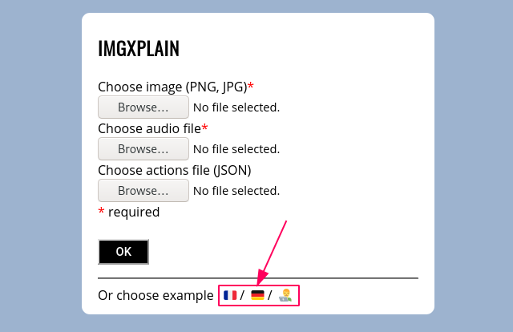
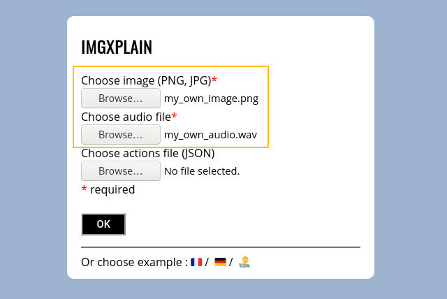
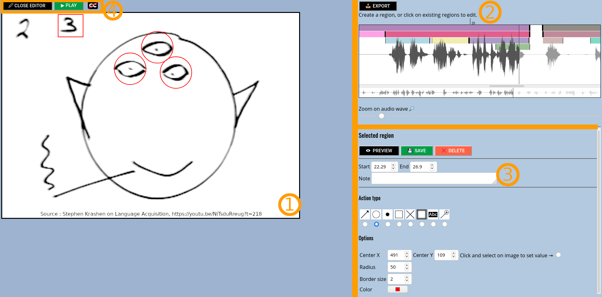

# Imgxplain

Try it here : https://norbjd.github.io/imgxplain/

## What is it ?

**Imgxplain**, as its name implies, is a tool designed to explain images with an audio description and specific timed actions, such as : drawing a rectangle, a circle, focusing on a particular zone, ...

## What is it for ?

**Imgxplain** can be used for :

- language learning
- any image description, for example, IT architecture schemas

It can help language learners to learn vocabulary from an image and an audio description, like in Krashen's video with Mr Spock (https://youtu.be/NiTsduRreug?t=218).

There are some examples on the landing page (french, german and IT architecture schema) to help you figure out what the tool is doing :

The tool is also an editor and can be used by "teachers" to create new resources.

## How can I use it ?

You can use your own images and audio tracks to create your image explanation : just choose an image and an audio track from your computer to import :

Once done, you'll land on the editor page where you can create regions relative to a part of the image and a part of the audio :

The screen is composed of 4 zones :

1. The imported image
2. The audio editor. Here you can create "regions" relative to a specific part of the audio. You can also export your work (*EXPORT* button) as a JSON file containing the different actions (see next point). This JSON can be imported (see previous picture, *Choose actions file (JSON)*)
3. The region editor. For the selected region, you can select different action types : drawing a rectangle, a circle, focusing on a zone, etc... on the image. As of now, the following actions are implemented :
    - draw an arrow
    - draw a circle
    - draw a point
    - draw a rectangle
    - focus on a rectangular zone
    - create a subtitle
    - zoom on a part of the image
4. Different buttons to open/close the editor on the right, play the audio, or enable/disable subtitles. Playing the audio runs the different actions defined and saved in point 3.